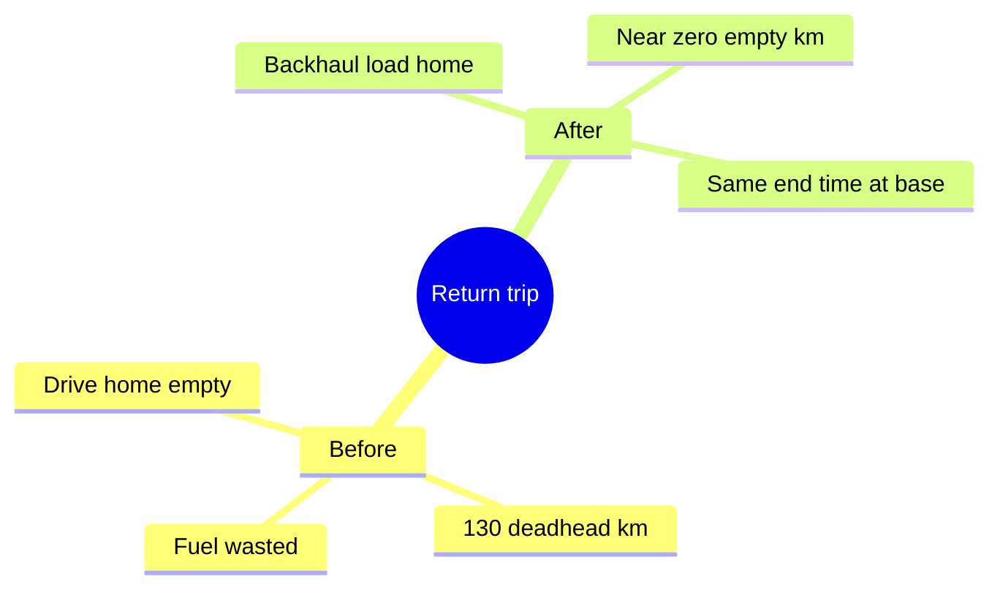

# Cutting Deadheads — A Worked Example

A "deadhead" is when a truck drives **empty** — no load on board. Empty miles still cost fuel, hours and money. One of the planner's top goals is to **cut deadhead miles**, and the return-to-base setting is the main lever. Here's a simple before/after to show how it works. (Numbers are illustrative.)

## The situation

- A driver is based at depot **BHX1** and must **return to base** at the end of the day.
- There's a load to run: **BHX1 → LTN2** (pickup at BHX1, drop at LTN2), about 130 km loaded.
- Separately, a customer also needs a load run **LTN2 → BHX1** the same day.

## Before — without smart return-to-base

The driver runs **BHX1 → LTN2** (130 km loaded), drops the load, then has to get **back to base**. With nothing planned for the return, the truck drives **LTN2 → BHX1 empty** — about **130 deadhead km**. That's roughly half the day's driving spent carrying nothing.

## After — the planner adds a backhaul

Because cutting empty miles is a top objective, the planner notices the **LTN2 → BHX1** load and gives it to the same driver as their **last job of the day**. Now the return trip is **loaded** (a "backhaul") instead of empty:

- **BHX1 → LTN2** (130 km loaded) → **LTN2 → BHX1** (130 km loaded).
- **Deadhead km: ~0.** The driver still ends at base, on time and within hours — but the truck earned its keep both ways.

## Why it worked

The planner only does this when it can:

- The driver has **return to base** on with **BHX1** as home, so the planner knows they must end at base — and a job whose drop **is** the home depot counts as a **loaded backhaul** (no empty leg needed).
- The backhaul fits the driver's **remaining hours** and **shift end** (the drive home is always reserved in the budget).
- So set **home depot + return to base** for drivers who go home, and keep return-direction loads in the pool — the planner will pair them up automatically.

## Before vs after

