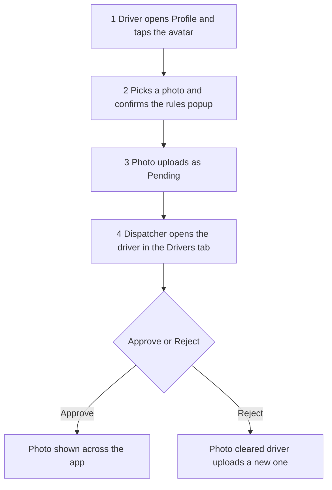

# Driver Profile Photos

Drivers can add a profile photo, but it only appears once **you (the dispatcher/admin) approve it** — so nothing inappropriate ever shows in the system without a check.

## Can a driver add a profile photo?

Yes. In the **driver app**, on the **Profile** tab, the driver taps the avatar (the circle above their name — it has a small camera badge) and picks a photo from their phone. A popup reminds them the photo must be a clear, appropriate headshot (no nudity/offensive content) and that **it needs dispatcher approval** before it shows. iPhone HEIC photos are converted automatically so they display everywhere. After uploading, the driver sees their photo with **"awaiting dispatcher approval."**

## How do I accept (approve) a photo a driver submitted?

In the dispatcher console, open the **Drivers** tab and click the driver. When they have a photo waiting, a **"Profile photo — pending review"** card appears at the top of their panel showing the image, with **Approve** and **Reject** buttons:
- **Approve** → the photo becomes the driver's avatar everywhere (driver app, the driver list, and their detail panel).
- **Reject** → the photo is cleared and the driver is asked to upload a suitable one.

## Where does the approved photo show?

Once approved it replaces the grey initials circle — in the **driver app** (their profile) and on the **dispatcher side** (the driver list rows and the driver detail panel). Until then, the live system keeps showing initials.

## How is inappropriate content prevented?

**Your approval is the gate** — no driver photo is shown anywhere until a dispatcher/admin approves it, and the driver is warned about the rules before uploading. Drivers cannot approve their own photo.

## The approval flow

