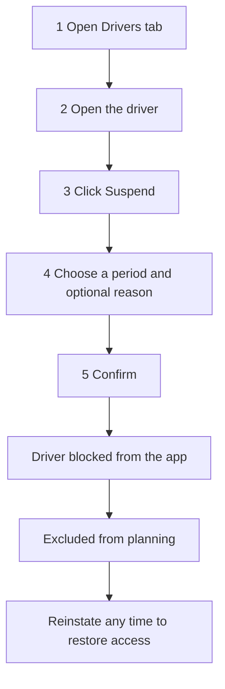

# Suspending & Reinstating Drivers

Yes — there **is** a built-in system to suspend and reinstate drivers, and you can do it yourself as a dispatcher or admin.

## Can I suspend a driver?

Yes. Open the **Drivers** tab, click the driver, and use the **Suspend** button in their panel. You choose how long:
- **1 day**, **1 week**, **1 month**, **Until a date** (pick one), or **Indefinite**,
- plus an optional **reason** (shown to the driver).

Confirm, and the driver shows a **"Suspended until …"** badge.

## What happens when a driver is suspended?

- They are **blocked from the driver app** — instead of the app they see a message explaining they're suspended (and until when), so they can't go on shift.
- They are **excluded from planning** — the planner won't assign routes to a suspended driver.

## How do I reinstate (un-suspend) a driver?

Open the driver again and click **Reinstate** — it clears the suspension immediately and they regain access to the app and planning. A timed suspension also lifts automatically once its end date passes.

## The suspend / reinstate flow

