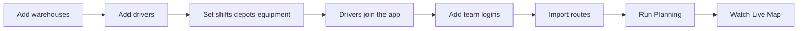

# First Week Setup

A short, ordered checklist to get a new operation up and running and planning well. The order matters: routes reference your warehouses, and the planner needs drivers, shifts and depots in place before it can do its best work.

## The setup sequence

1. **Add your warehouses first.** Every route is a chain of warehouse codes, and the planner uses warehouse **coordinates** for distances and ETAs — so set these up before importing routes. Add them on the **Warehouses** tab (or bulk **Import CSV**), making sure each has the right **code**, **latitude** and **longitude**.

2. **Add your drivers.** On the **Drivers** tab, add each driver (name, optional phone).

3. **Set each driver's shift, depot and equipment.** Open each driver and set their **weekly shift pattern** (days + start/end times), their **home warehouse** and whether **return to base** is required, and the **equipment** they're qualified to operate. This is what lets the planner pick the right people, keep them legal, and cut empty miles.

4. **Get every driver onto the driver app.** From each driver's profile (Drivers tab → Contact information → **App code**), **Share** the code so the driver signs in on their phone. Once on the app they send live GPS and can submit tachograph hours — the two things that make planning accurate.

5. **Add your team (admins only).** On the **Team** tab, create logins for your dispatchers so they can sign in to the console.

6. **Import your routes.** On the **Dispatch** tab, **Import CSV** your day's routes (standard or FMC export). Each becomes a PENDING route with stops, scheduled times and equipment.

7. **Run Planning.** Press **Planning** on Dispatch. The app assigns and sequences every route. Use **Audit Plan** first if you want to preview coverage and see any gaps with reasons.

8. **Watch it run on the Live Map.** As drivers work, their positions and progress appear live, and re-running Planning re-optimises from reality.

## Setup flow

## Tips for a good first plan

- Double-check **warehouse coordinates** — wrong coordinates mean wrong distances and bad assignments.
- Make sure drivers are **on the app** (so the planner uses real positions, not just the depot).
- Set **shift patterns** accurately so nobody is planned outside their hours.
- Set **home depot + return to base** for drivers who go home, to cut deadheads.
- Every route needs a **service date** — routes without one can't be planned.
