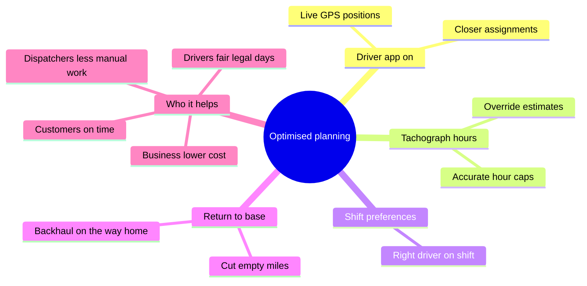

# Getting the Best Out of Planning

The planner is only as good as the data it's given. To get the most optimised plan — best coverage, fewest empty miles, fully legal days — there are a few things every operation should put in place. Here's what they are, why they matter, and **who they help**.

## What do I need for planning to be optimised?

In short: **every driver on the app**, **tachograph hours submitted**, **shift preferences set**, and **home depot + return-to-base configured** for drivers who go home. Each one feeds the planner real data so it can make better decisions.

## 1. Every driver should use the driver app

The driver app sends each driver's **live GPS position** (a battery-friendly ping every ~5 minutes). The planner uses that real position to assign the **closest** suitable driver to each pickup and to chain their day from where they actually are. If a driver isn't on the app, the planner can only fall back to their home depot — so assignments are less accurate and the Live Map can't show them. **The more drivers on the app, the better every plan gets.**

## 2. Drivers should submit their tachograph hours

The app lets drivers submit their **tachograph hours**. Submitted weekly totals **override the system's own estimate** for completed weeks, so the planner's HGV limits (**9h/day, 56h/week, 90h/fortnight**) stay aligned with the real, legal record. That keeps the system and the tacho in sync — the planner won't over-allocate a driver who's actually low on hours, or wrongly hold back one who has hours to spare.

## 3. Set each driver's shift preferences

The planner only uses drivers who are **on shift** that day and who can **finish within their shift hours** (start and end time), and it respects **holidays**. Keeping each driver's weekly shift pattern and preferences accurate means the planner picks the right people and never plans work outside someone's agreed hours.

## 4. Set home depot + return-to-base to cut deadheads

For drivers who must return to their depot, set their **home warehouse** and turn on **return to base**. The planner then does two things:

- It **reserves the trip home** in their hours and shift so they always make it back in time.
- Because cutting **empty (deadhead) miles is one of the planner's top objectives**, it tries to give the driver a job whose drop is **on the way home** — a **loaded backhaul** — instead of running the truck back empty. Less empty running means lower fuel and cost.

## Who does this help?

- **Dispatchers / planners** — far less manual assigning, better coverage, fewer compliance mistakes.
- **Drivers** — fair, legal days within their hours and shifts, and less time driving empty.
- **The business / owner** — lower fuel and deadhead cost, lower compliance risk, more loads covered per driver.
- **Customers** — more reliable, on-time deliveries.

## The optimisation tree

